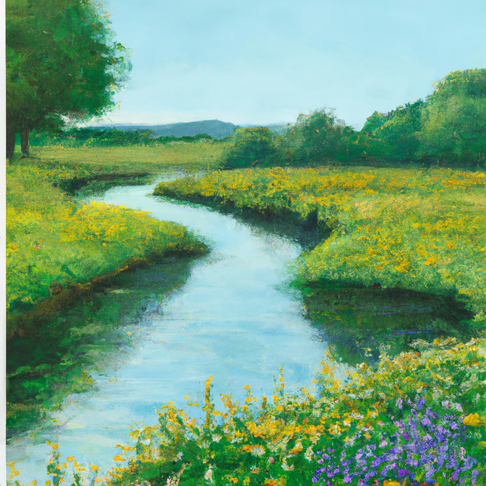
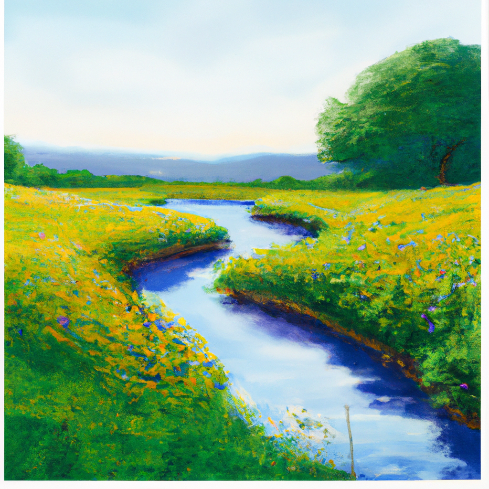
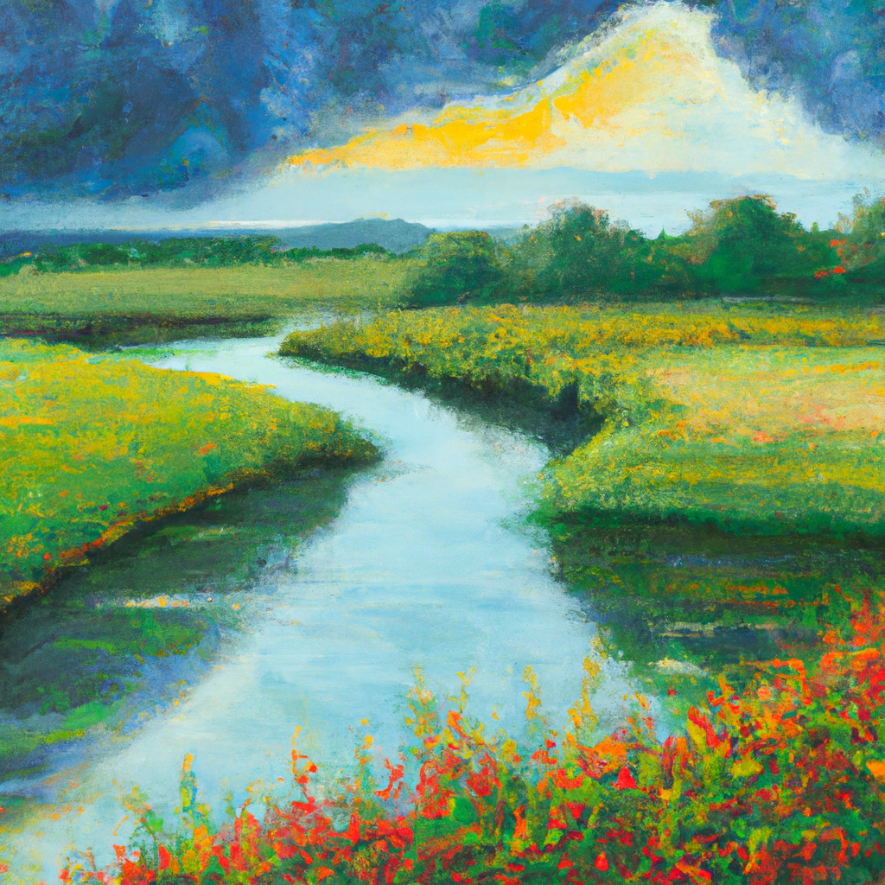

# OpenAI Image Tools

1. 🚀 Get OpenAI API key from [here](https://platform.openai.com/api-keys)
2. 🏄‍♂️ Install dependencies

```bash
pip install openai
```

All the results are saved in the `generated_images`, `variation_images`, and `edited_images` folders.

## Generate Images

Run the following command to generate an image.You can choose the model, size, and prompt. 
The number of images to generate is *n*.

* models: `dall-e-2`, `dall-e-3`


```bash 
export OPENAI_API_KEY=YOUR_API_KEY
python generate.py  --n 1 --model dall-e-2 --size 1024x1024 --prompt "An impressionist-style landscape painting reminiscent of Monet or Manet. The scene showcases a peaceful countryside with a meandering river surrounded by vibrant greenery and blooming flowers."
```



## Create Variations

The variation does not support a prompt as input. It only takes an existing image as input.

```bash 
export OPENAI_API_KEY=YOUR_API_KEY
python variation.py --n 1 --model dall-e-2 --image-path generated_images/example.png --size 1024x1024
```



## Edit Images

Mask image is a black and white image where 
* the black areas are the areas that will **be edited**.
* the white areas are the areas that will **remain unchanged**.


```bash 
export OPENAI_API_KEY=YOUR_API_KEY
python edit.py --prompt "A dark and moody landscape painting reminiscent of Monet or Manet. The scene showcases a stormy countryside with a meandering river surrounded by vibrant greenery and blooming flowers." --n 1 --model dall-e-2 --image-path generated_images/example.png  --mask-path masks/example.png
```

<table>
  <tr>
    <td></td>
    <td></td>
    <td></td>
  </tr>
  <tr>
    <td>Generated Image</td>
    <td>Mask Image</td>
    <td>Edited Image</td>
  </tr>
</table>
